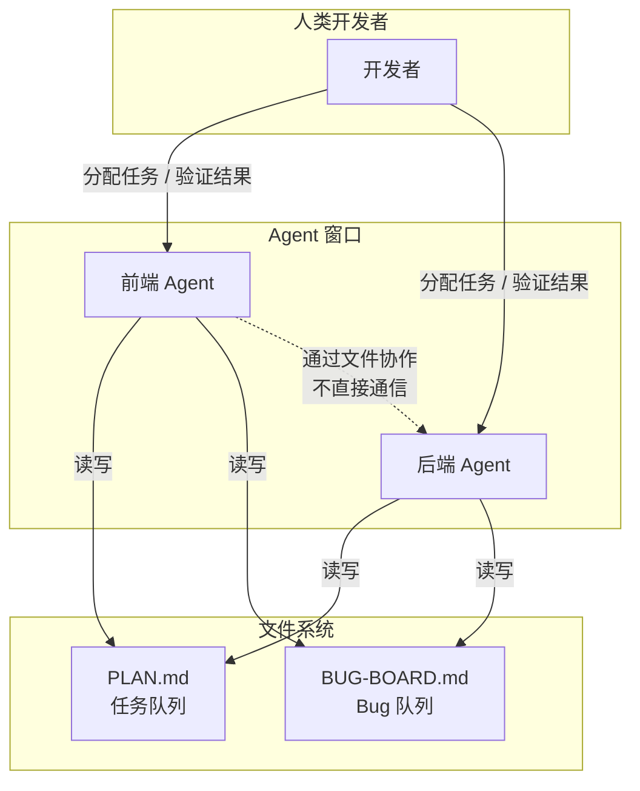
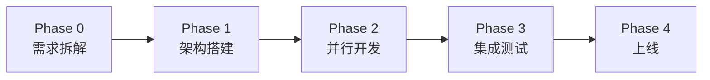
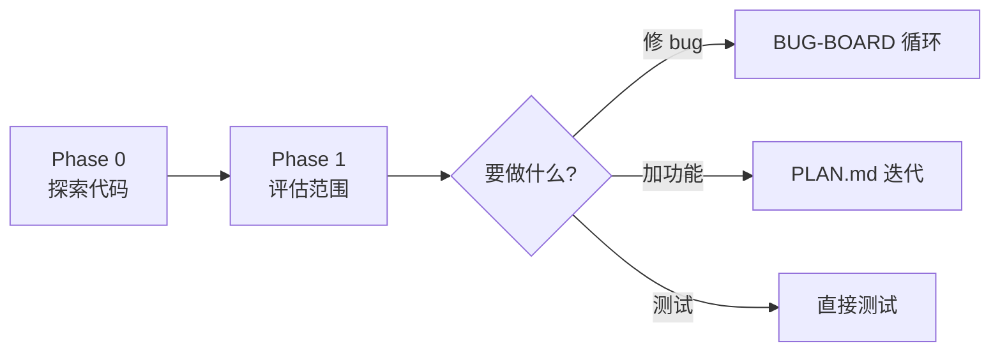
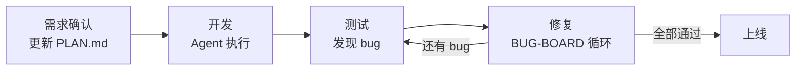
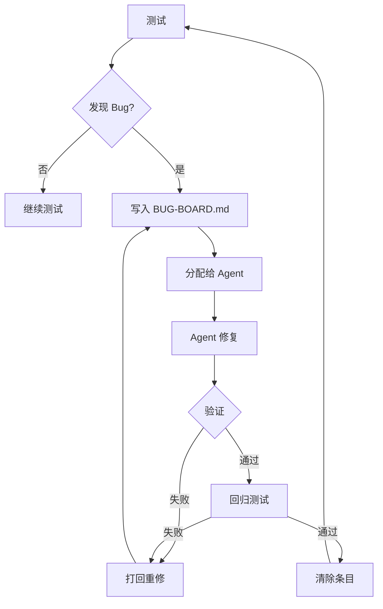
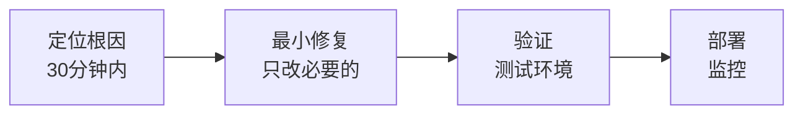
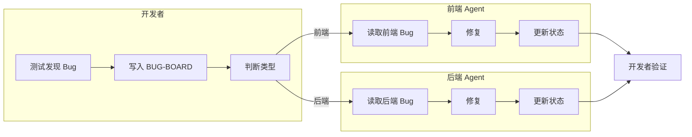
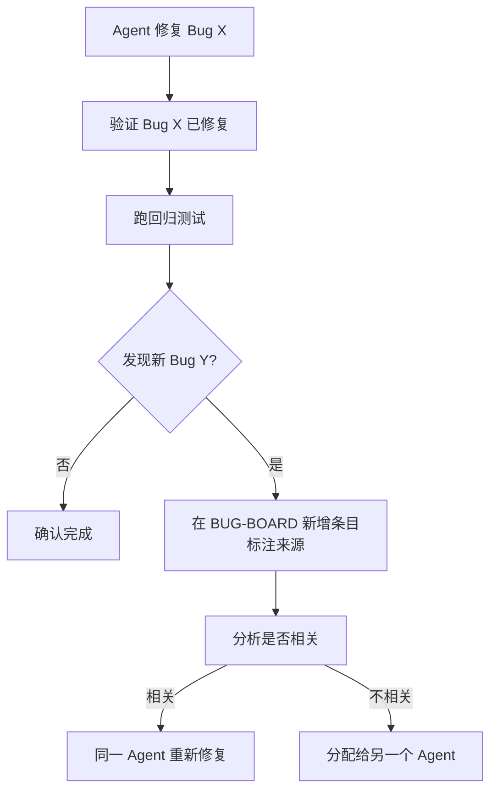

# Agent 工作流 — 设计说明

> 基于 DHH（David Heinemeier Hansson）AI 工作流实践经验，适配 .NET 全栈项目的多 Agent 协作模式。

---

## 1. 这套模式解决什么问题

当 AI 把写代码变得几乎免费，软件工程的瓶颈从"代码吞吐量"迁移到"人的判断力"。本方案帮助开发者从"逐行写代码"转型为"调度 Agent + 审查产出"，用更少的时间处理更多的工作。

**核心转变：**

```
传统模式：  开发者 = 执行者（写代码）
本方案：    开发者 = 调度者 + 裁判（分配任务 + 审查产出）
            Agent  = 执行者（写代码 + 修 bug）
```

---

## 2. 设计原则

### 原则一：异步优先（Async-First）

> "Chat is not the ideal way for agents to collaborate." — DHH

Agent 之间不通过聊天互相等待。所有协作通过文件异步完成。前端 Agent 发现后端 bug，写入文件后继续自己的工作，不用停下来等后端 Agent 修完。

### 原则二：文件即通信（File as Communication）

文件是唯一的真相来源（Single Source of Truth）。不在聊天里描述应该写在文件里的东西。

| 文件 | 作用 | 类比 |
|---|---|---|
| PLAN.md | 任务队列 | JIRA / Trello 看板 |
| BUG-BOARD.md | Bug 队列 | GitHub Issues |

### 原则三：人做裁判（Human as Judge）

Agent 可以修复代码，但"这个修复是否足够好"的判断必须由人来做。随着 Agent 产出越来越多，判断力成为最稀缺的资源。

### 原则四：质量先于速度（Quality Before Speed）

> "局部正确的 PR 合起来毁掉架构" — DHH 的 Basecamp 5 教训

Agent 修一个 bug 时可能引入另一个 bug。每次修复后必须做回归测试。

### 原则五：最小改动（Minimal Change）

Agent 只改动必须改的代码，不做格式化、空格调整、编码转换等无意义修改。这通过三层防护实现：
1. Agent Prompt 中明确禁止无意义修改
2. `.editorconfig` 统一项目格式标准
3. Git pre-commit hook 自动拦截纯空格提交

---

## 3. 系统架构



---

## 4. 场景工作流

### 4.1 场景 A：新项目全周期



- **Phase 0**：开发者和 Agent 对话，拆解需求，写 PLAN.md
- **Phase 1**：开发者定技术方案，Agent 生成项目骨架
- **Phase 2**：多 Agent 并行开发不同模块，用 PLAN.md + 接口契约协调
- **Phase 3**：走 BUG-BOARD 循环（同场景 D）
- **Phase 4**：开发者最终审查，部署上线

### 4.2 场景 B：中途接手项目



- **Phase 0（必须做）**：让 Agent 读代码，输出架构概览、关键文件索引
- **Phase 1**：明确任务目标和改动范围
- **Phase 2**：根据任务类型切换到对应工作流

### 4.3 场景 C：迭代开发



- **PLAN.md 是主角**，记录迭代目标和任务列表
- 开发和测试交替进行
- 已上线项目需要灰度发布

### 4.4 场景 D：测试修复



- **BUG-BOARD.md 是主角**
- 每次修复后必须验证 + 回归测试

### 4.5 场景 E：线上 Hotfix



- **速度优先，但最小改动**
- 不顺手重构，不改无关代码
- 修复后必须在测试环境验证
- 部署后持续监控

---

## 5. 并行修复流程



---

## 6. 异常处理：修复引入新 Bug



---

## 7. 与 DHH 实践的映射

| DHH 的经验 | 本方案的对应 |
|---|---|
| 16 条并行线程 | 2-3 个并行 Agent 窗口 |
| Herder（可观测性） | BUG-BOARD.md（状态追踪） |
| 任务队列替代聊天 | 文件替代窗口间消息传递 |
| Agent 初审 + 人做 merge | Agent 修复 + 开发者验证 |
| Plan 跨 agent 传递状态 | PLAN.md + BUG-BOARD.md |
| Brains and Hands 分离 | 开发者 = 大脑，Agent = 双手 |
| 局部正确的 PR 毁掉架构 | 回归测试确保无新 bug |

---

## 8. 适用范围

**适合：**
- .NET 全栈单体项目
- 开发者有一定 .NET 经验，能判断代码质量
- 项目规模中等（单个 solution）

**不适合：**
- 架构设计阶段（需要人来设计）
- 微服务/分布式系统（需要更复杂的协调）
- 多人大团队（本方案是单人多 Agent 模式）
